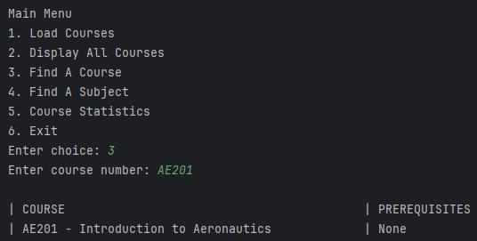
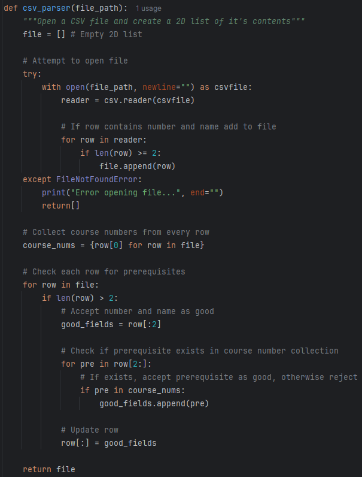
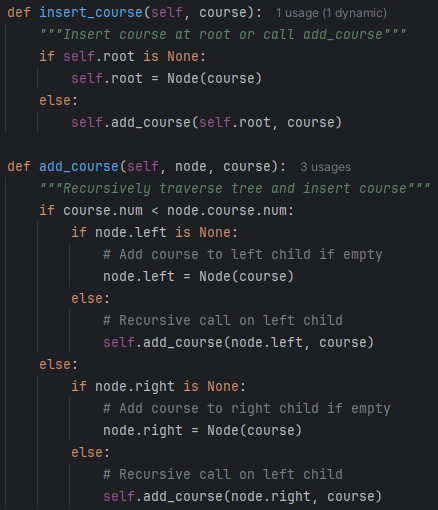
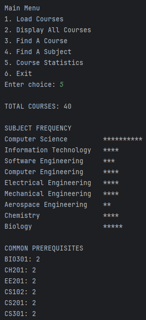

## Portfolio Links

[Home](./index.html) |
[Code Review](https://www.youtube.com/watch?v=WWt6o8kGqrE) |
[Software Design & Engineering](./softwaredesignengineering.html) |
[Algorithms & Data Structures](./algorithmsdatastructures.html) |
[Databases](./databases.html)

# Original Artifact

The original artifact was the portfolio item for CS-300 completed in December of 2025. It was written in C++ and features a CSV parser written by me. This parser creates a 2D vector of academic courses with prerequisites that can be searched efficiently using a binary search tree with various algorithms. I selected this artifact because it contains advanced algorithmic concepts including recursion and parent/child nodes, I also felt it would benefit from being translated to Python and having it’s analysis functionality expanded.

# Enhancements Made

The program was successfully translated to Python while preserving its functionality and BST. The Course structure was converted to a Python @dataclass, and the BST, node structure, insert, search, traverse, CSV parse, course load, and main menu logic were all rewritten. The code was also streamlined with cleaner output, simplified input validation, and Pythonic file handling.

New features were added such as a Find-by-Subject option and Subject sub-menu that allows users to view courses within a selected subject using the new search_subject and print_subject BST methods. A Statistics feature was also introduced through the gen_stats and counter methods which print information such as the total number of courses, subject frequency, and most common prerequisites.

The Python version maintains the behavior of the original C++ while improving readability, expanding functionality, and making the program easier to maintain.

[Course Catalog Binary Search Tree Repository](https://github.com/SebStohn/SebStohn.github.io/tree/main/2.%20CSV%20Parser%20BST)

# Course Outcomes

The outcome I set out to meet with this category was: “Design and evaluate computing solutions that solve a given problem using algorithmic principles and computer science practices and standards appropriate to its solution, while managing the trade-offs involved in design choices.” I believe I’ve met this outcome because I’ve shown ability to write, comprehend, explain, and apply complex algorithms and data structures in a constructive way.

# Reflection

When updating this project I found that I hadn’t worked in Python is quite some time. Once I was back in rhythm I was able to translate the existing codebase with little difficulty, even adding some formatting along the way. When adding functionality I really had to pay attention to datatypes and scope to make sure that I was working with fields when I wanted fields, and addresses when I wanted addresses.

Adding the statistical option was challenging because I had to change how I approached it. The BST was a hand-written structure so it doesn’t have built-in functions, this made taking statistics on its contents more interesting. The problem was solved with lists and a recursive algorithm that tracks courses and prerequisites that can then be analyzed.
