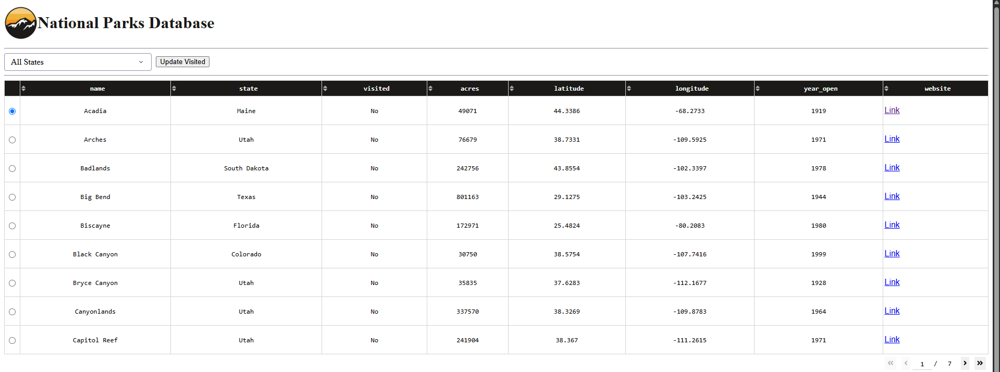
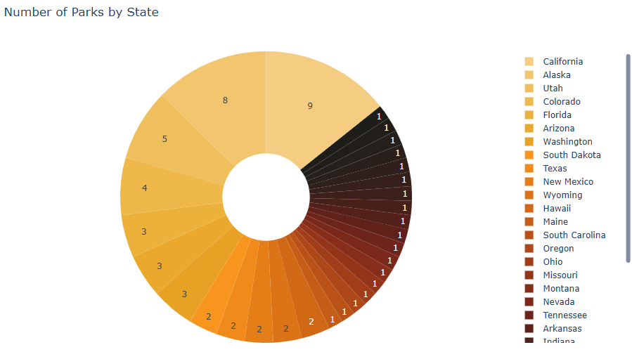
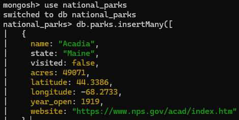
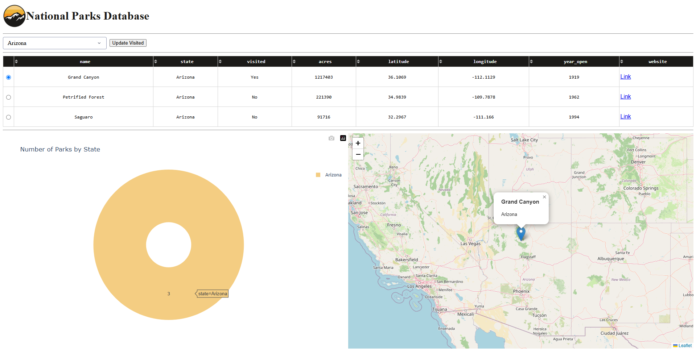

## Portfolio Links

[Home](./index.html) |
[Code Review](https://www.youtube.com/watch?v=WWt6o8kGqrE) |
[Software Design & Engineering](./softwaredesignengineering.html) |
[Algorithms & Data Structures](./algorithmsdatastructures.html) |
[Databases](./databases.html)

# Original Artifact

The original artifact was the portfolio item for CS-340 completed in April 2026. It was written in Python and Jupyter notebook and contains a Python CRUD module along with a Jupyter dashboard that was used to access a MongoDB database of rescue animals. I selected this artifact because it contains work both in accessing the database through CRUD, but also displaying that data in a useful way to the user. The project relied heavily on the Codio environment during the course so I knew that I wanted to refactor the Jupyter elements to work in regular Python. I also knew that I wanted to change the subject matter to something I was more interested in, so I settled on pivoting and creating a MongoDB database of US National Parks.

# Enhancements Made

The CRUD module and Dash dashboard were refactored by renaming all class names, variables, and database connections to reflect the new subject. The dashboard was converted from Jupyter notebook to standalone Python, and the MongoDB connection was configured and tested. The data frame columns were updated and the table was modified to display them. The radio button filters were replaced with a dropdown menu that dynamically filters parks by state. An “Update Visited” button was also added which toggles the "visited" field of the currently selected park using the CRUD Module’s “update” functionality.

The pie graph was redesigned to display the number of national parks by state, and the geolocation map was updated to center on the selected park. Other visual changes included fixing the layout, updating colors, enabling table sorting, and formatting website links. Finally, the MongoDB database was populated with records for all 63 U.S. national parks.

Overall, this is a cleanly repurposed dashboard that exists as a National Parks information system. It demonstrates CRUD database operations, interactive data visualization, and dynamic interaction using Python, Dash, and MongoDB.

[National Parks Info & Data Visualization Dashboard Repository](https://github.com/SebStohn/SebStohn.github.io/tree/main/3.%20CRUD%20Module)

# Course Outcomes

The outcome I set out to meet with this category was: “Design, develop, and deliver professional-quality oral, written, and visual communications that are coherent, technically sound, and appropriately adapted to specific audiences and contexts.” This project touched on this outcome because it involved communicating data visually in a coherent, technically sound, and appropriately adapted way.

# Reflection & Challenges

When building this project outside of the Codio environment I at first struggled to get everything configured with MongoDB and Dash. Converting everything to reflect the new subject matter was also challenging because so much needed to be changed. I really feel like I have a better understanding of how the database interacts with the Module, I also gained more experience working directly in MongoDB. The main challenges I faced were:
Formatting everything properly was difficult because the only time I had worked with HTML through Python prior to this was this very assignment in CS-340.

Callbacks are important to this enhancement since they are what drives the interaction. I had to meet the challenge of writing them correctly and understanding their application to make the dashboard as responsive as possible. Getting the functions under each callback correct was also challenging just because there is always so much more going on behind the scenes than initially meets the eye.

