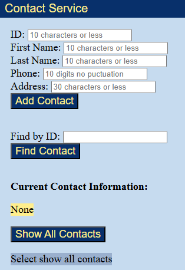
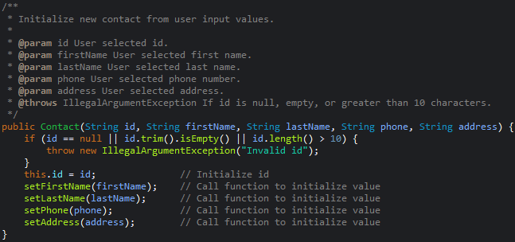
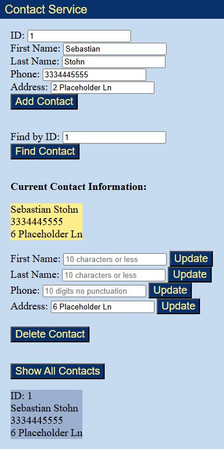

## Portfolio Links

[Home](./index.html) |
[Contact.io](./softwaredesignengineering.html) |
[Coursearch](./algorithmsdatastructures.html) |
[National Park Explorer](./databases.html)

# Contact.io

### [Contact.io Repository (download, explore, etc.)](https://github.com/SebStohn/SebStohn.github.io/tree/main/1.%20Contact%20Service)

Contact.io was built around two java classes: Contact and ContactService. The application uses Java and Spring Boot as the backend architecture including a Contact model, service layer, REST controller, application entry point, and exception handler.

The backend exposes RESTful API endpoints that allow users to create, retrieve, update, and delete contacts, as well as retrieve all contacts. The front-end features an HTML, CSS, and JavaScript UI that communicates with the Spring Boot backend through fetch calls. Users can add, find, update, and delete contacts, and display a complete list of contacts through the interface.

Input validation prevents invalid or empty info along with updated error handling that provides users with meaningful feedback.

# Technical Specifications

The existing Contact (pictured above) and ContactService classes were upgraded to use Spring Boot. The service layer was added by annotating ContactService with @Service. A ContactApp entry point and a ContactController were created to expose the REST endpoints. An Exception Handler class was written to provide more meaningful error messages. Validation within the Contact class also was also improved to reject empty inputs that were causing bugs. A basic user interface was also developed using HTML, CSS, and JavaScript with fetch() calls so users can add, find, and delete contacts through the API. Finally, update functionality was added for each mutable contact field resulting in a complete CRUD application that takes full advantage of the original service.

The HTML was enhanced by adding placeholder text to input fields to provide users with expected value formats. A getAllContacts() method was added to the service layer and exposed through a new REST endpoint in the controller. The JavaScript was also updated with a matching getAllContacts() function that retrieves the complete list of contacts and displays it to the user.
