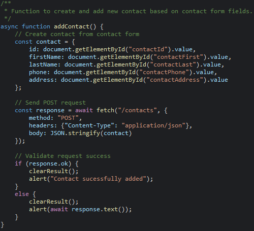

## Portfolio Links

[Home](./index.html) |
[Contact.io](./softwaredesignengineering.html) |
[Coursearch](./algorithmsdatastructures.html) |
[National Park Explorer](./databases.html)

# Contact.io

Contact.io started as two Java classes: Contact and ContactService. The application uses Java and Spring Boot as the backend architecture including a Contact model, service layer, REST controller, application entry point, and exception handler.

The backend also exposes RESTful API endpoints that allow users to create, retrieve, update, and delete contacts, as well as retrieve all contacts. The front-end features an HTML, CSS, and JavaScript UI that communicates with the Spring Boot backend through fetch calls. Users can add, find, update, and delete contacts, and display a complete list of contacts through the interface.

### [Contact.io Repository](https://github.com/SebStohn/SebStohn.github.io/tree/main/1.%20Contact%20Service)

# Technical Specifications

The existing Contact (pictured above) and ContactService classes were moved into a Maven project which was upgraded to use Spring Boot. The service layer was added by annotating ContactService with @Service. A ContactApp entry point and a ContactController were created to expose the REST endpoints. A helper method was added to ContactService to reduce repeated code and a ContactExceptionHandler class was written to provide more meaningful error messages. Validation within the Contact class also was improved to reject empty inputs that were causing bugs. A basic user interface was also developed using HTML, CSS, and JavaScript with fetch() calls so users can add, find, and delete contacts through the API. Finally, update functionality was added for each mutable contact field resulting in a complete CRUD application that takes full advantage of the original service.

The JavaScript (pictured above) was streamlined with helper functions to reduce repeated code. The HTML was also enhanced by adding placeholder text to input fields to provide users with expected value formats. A getAllContacts() method was added to the service layer and exposed through a new REST endpoint in the controller. The JavaScript was updated with a matching getAllContacts() function that retrieves the complete list of contacts and displays it to the user. Finally, a corresponding "Show All Contacts" button was added to the HTML.

# Reflection

When updating the project to take advantage of Spring Boot I was reminded of how much work goes into just setting up the web environment for a few classes to run on. Looking further into error messages was a good experience since I learned how to give the user more feedback to make the app easier to use. I got to implement my HTML/CSS/JS skills I learned in Web Site Design while also gaining more experience integrating JavaScript.

The first challenge was that the contact class was allowing empty fields to be passed into contact objects because it didn’t understand the difference between NULL and an empty string. This problem was solved by adding an additional check to the contact class. Another challenge was dealing with hiding and unhiding certain UI objects in HTML and JS. I had little experience with that particular skill so learning more about those functions was extremely helpful. The final challenge was making the UI make sense based on the most recent user input. This mostly involved “clearing the decks” of the contact that the user was currently working with when they performed a different action or made a bad input. Making it follow logical sense while still performing correctly was a good test for me. This challenge continued during the polishing phase as I added more API endpoints and continued to add functionality to the front-end.
